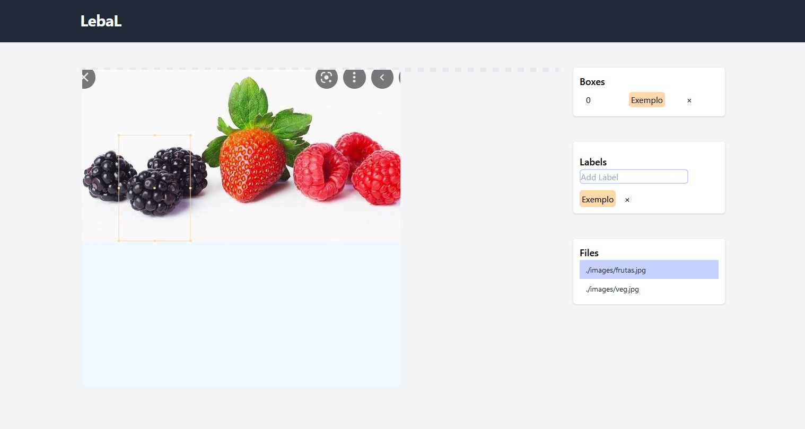

# LebaL

This project is a POC of a active learning labelling app.

Frontend --> svelte with tailwindcss

Backend --> Fastapi

Orchestration --> docker compose



TODO:
- [ ] frontend: add class to box
- [ ] frontend: edit class box
- [ ] frontend: redraw when deleted
- [ ] backend: save files
- [ ] backend: send files, and boxes
- [ ] backend: active learning
- [ ] backend: send predictions of file
- [ ] docker_compose.yaml


## Development
After cloning the repo, to run the frontend you should execute:

```
    npm install
```
to deploy the server on port 5173
```
    npm run dev
```
